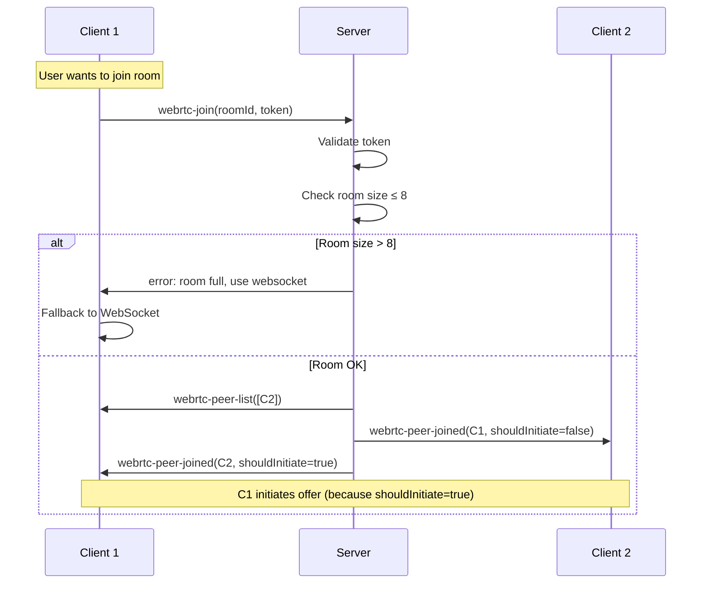
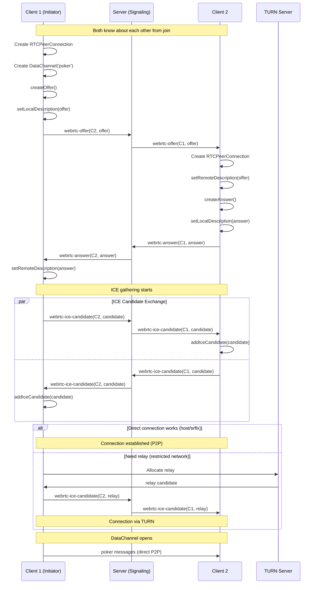
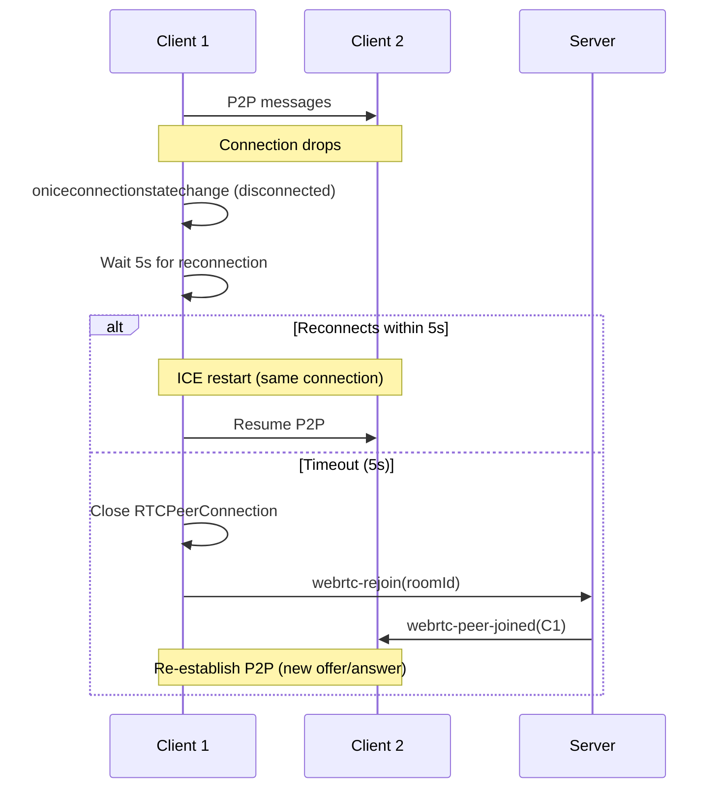
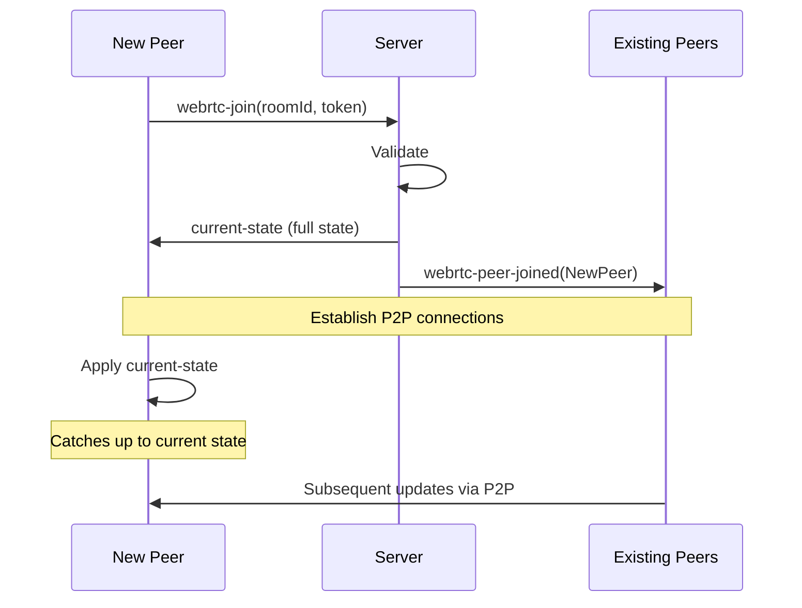

# P2P WebRTC Design Document

## Status

**Proposta** — Este documento descreve um design futuro. A implementação está planejada mas não iniciada.

---

## 1. Motivação e Objetivos

### Motivação

O Buddy Poker atualmente suporta comunicação em tempo real via **WebSocket** com **fallback para HTTP polling**. Embora essa abordagem funcione bem para a maioria dos casos, existem oportunidades de melhoria:

1. **Redução de carga no servidor**: Com P2P, a maior parte da comunicação acontece diretamente entre clientes, reduzindo drasticamente o número de mensagens processadas pelo servidor.

2. **Latência reduzida**: Comunicação direta peer-to-peer elimina o hop pelo servidor, resultando em updates mais rápidos (especialmente importante para salas com muita atividade).

3. **Escalabilidade**: Com até 8 participantes por sala em topologia mesh, o servidor atua principalmente como sinalizador, permitindo escalar para mais salas simultâneas com a mesma infraestrutura.

4. **Resiliência**: P2P pode continuar funcionando mesmo se a conexão com o servidor for degradada (após o estabelecimento inicial).

### Objetivos

- **Modo P2P para todas as comunicações**: Ações (join, vote, reveal, reset) e updates de estado devem ser transmitidos via WebRTC DataChannel quando possível.

- **Suporte para até 8 participantes**: Utilizar topologia mesh completa (full mesh) onde cada peer se conecta diretamente a todos os outros.

- **Servidor mínimo como sinalizador**: O servidor continua responsável por:
  - Sinalização (signaling) para estabelecer conexões P2P
  - Validação de tokens de sala
  - Broadcast inicial do estado da sala
  - Fallback quando P2P não é viável

- **Funcionar em redes restritas**: Garantir que P2P funcione mesmo em redes corporativas/firewall usando TURN (coturn em `turns:443`).

- **Fallback transparente**: Quando P2P não estiver disponível, o app deve automaticamente usar WebSocket ou HTTP polling (arquitetura existente).

- **Retorno a P2P**: Quando as condições melhorarem (ex.: após resolver problemas de rede), o app deve tentar retornar ao modo P2P.

---

## 2. Não-Objetivos

- **Não é objetivo** substituir completamente o servidor. O servidor continua essencial para sinalização, autenticação e fallback.

- **Não é objetivo** suportar mais de 8 participantes em modo P2P. Para salas maiores, o sistema usará automaticamente WebSocket/HTTP.

- **Não é objetivo** implementar topologias complexas (ex.: SFU, MCU). A topologia será mesh simples.

- **Não é objetivo** garantir P2P em 100% dos cenários. Alguns ambientes (ex.: redes extremamente restritas sem TURN) cairão para WebSocket/HTTP.

- **Não é objetivo** implementar encriptação adicional além do que WebRTC já fornece (DTLS).

---

## 3. Arquitetura Alvo

### 3.1. Três Modos de Transporte

O sistema suportará **três modos de transporte**, com prioridade decrescente:

1. **P2P / WebRTC DataChannel** (modo preferencial)
   - Comunicação direta peer-to-peer
   - Usado quando todos os peers conseguem estabelecer conexões P2P
   - Limitado a salas com ≤ 8 participantes

2. **WebSocket** (primeiro fallback)
   - Comunicação via servidor WebSocket
   - Usado quando P2P não é viável ou sala > 8 participantes
   - Já implementado

3. **HTTP Polling** (fallback final)
   - Comunicação via requisições HTTP
   - Usado quando WebSocket também não está disponível
   - Já implementado

### 3.2. Diagrama de Arquitetura

```
┌─────────────────────────────────────────────────────────────┐
│                        Client (Browser)                      │
│                                                               │
│  ┌───────────────────────────────────────────────────────┐  │
│  │              PokerWsService (Facade)                   │  │
│  │  - connect(), vote(), reveal(), reset()                │  │
│  │  - state$, status$, mode$                              │  │
│  └──────┬──────────────────────────────────────────────────┘  │
│         │                                                     │
│         │ delegates to current transport                     │
│         ▼                                                     │
│  ┌────────────────────────────────────────────────┐          │
│  │         Transport (interface)                  │          │
│  └────────┬───────────────┬───────────────┬───────┘          │
│           │               │               │                  │
│           ▼               ▼               ▼                  │
│  ┌─────────────┐ ┌──────────────┐ ┌───────────────┐         │
│  │ WebRtc      │ │ WebSocket    │ │ HttpPolling   │         │
│  │ Transport   │ │ Transport    │ │ Transport     │         │
│  │ (new)       │ │ (existing)   │ │ (existing)    │         │
│  └──────┬──────┘ └──────┬───────┘ └───────┬───────┘         │
│         │               │                 │                  │
└─────────┼───────────────┼─────────────────┼──────────────────┘
          │               │                 │
          │               │                 │
    P2P   │     WS        │      HTTP       │
    DataChannel   ┌───────▼─────────────────▼────────┐
          │       │                                   │
          │       │         Server (Node.js)          │
          │       │  - Signaling (for WebRTC)         │
          │       │  - WebSocket handler              │
          │       │  - HTTP endpoints                 │
          │       │  - State authority (optional)     │
          │       └───────────────────────────────────┘
          │
          └─────────────────┐
                            │
                  ┌─────────▼──────────┐
                  │   TURN Server      │
                  │   (coturn)         │
                  │   turns:443        │
                  └────────────────────┘
```

---

## 4. Componentes

### 4.1. WebRtcTransport (Client)

Implementação do transporte P2P usando WebRTC DataChannel.

**Responsabilidades:**
- Gerenciar conexões RTCPeerConnection com todos os peers
- Abrir e manter DataChannels para comunicação
- Participar do processo de sinalização (via SignalingService)
- Negociar ICE candidates e SDP offer/answer
- Detectar e reportar falhas de conexão P2P
- Implementar estratégia anti-glare (offer collision)

**API:**
```typescript
interface WebRtcTransport extends Transport {
  // Inherited from Transport
  connect(roomId: string, name: string, token?: string): void;
  disconnect(): void;
  send(message: PokerWsMessage): void;
  
  // WebRTC specific
  getPeerConnections(): Map<string, RTCPeerConnection>;
  getConnectionStats(): Promise<RTCStatsReport[]>;
}
```

**Configuração:**
```typescript
interface WebRtcConfig {
  iceServers: RTCIceServer[];  // STUN/TURN servers
  connectionTimeout: number;    // Timeout para estabelecer conexão P2P (padrão: 15s)
  maxPeers: number;            // Máximo de peers (padrão: 8)
  dataChannelOptions: {
    ordered: boolean;          // Ordenação garantida (padrão: true)
    maxRetransmits?: number;   // Max retransmissões (padrão: undefined = reliable)
  };
}
```

### 4.2. SignalingService (Client)

Serviço responsável por trocar mensagens de sinalização via servidor.

**Responsabilidades:**
- Enviar/receber SDP offers e answers
- Enviar/receber ICE candidates
- Descobrir peers na sala
- Coordenar timing de offers para evitar glare

**API:**
```typescript
interface SignalingService {
  // Connect to signaling server
  connect(roomId: string, token?: string): Promise<void>;
  
  // Send signaling messages
  sendOffer(targetPeerId: string, offer: RTCSessionDescriptionInit): void;
  sendAnswer(targetPeerId: string, answer: RTCSessionDescriptionInit): void;
  sendIceCandidate(targetPeerId: string, candidate: RTCIceCandidate): void;
  
  // Receive signaling messages (observables)
  onPeerJoined$: Observable<{ peerId: string; shouldInitiate: boolean }>;
  onOffer$: Observable<{ fromPeerId: string; offer: RTCSessionDescriptionInit }>;
  onAnswer$: Observable<{ fromPeerId: string; answer: RTCSessionDescriptionInit }>;
  onIceCandidate$: Observable<{ fromPeerId: string; candidate: RTCIceCandidate }>;
  onPeerLeft$: Observable<{ peerId: string }>;
  
  disconnect(): void;
}
```

**Implementação:**
- Usa WebSocket para comunicação com o servidor
- Mensagens de sinalização são enviadas como mensagens WS específicas (tipo `webrtc-signal`)

### 4.3. Servidor — Signaling Endpoints

O servidor precisa de novos endpoints/mensagens para sinalização:

**WebSocket Messages (signaling):**
```typescript
// Client → Server
{
  type: 'webrtc-join',
  roomId: string,
  token?: string
}

{
  type: 'webrtc-offer',
  roomId: string,
  targetPeerId: string,
  offer: RTCSessionDescriptionInit
}

{
  type: 'webrtc-answer',
  roomId: string,
  targetPeerId: string,
  answer: RTCSessionDescriptionInit
}

{
  type: 'webrtc-ice-candidate',
  roomId: string,
  targetPeerId: string,
  candidate: RTCIceCandidate
}

// Server → Client
{
  type: 'webrtc-peer-joined',
  peerId: string,
  shouldInitiate: boolean  // true se este cliente deve iniciar offer
}

{
  type: 'webrtc-offer',
  fromPeerId: string,
  offer: RTCSessionDescriptionInit
}

{
  type: 'webrtc-answer',
  fromPeerId: string,
  answer: RTCSessionDescriptionInit
}

{
  type: 'webrtc-ice-candidate',
  fromPeerId: string,
  candidate: RTCIceCandidate
}

{
  type: 'webrtc-peer-left',
  peerId: string
}
```

**Responsabilidades do servidor:**
- Rotear mensagens de sinalização entre peers
- Validar tokens de sala antes de permitir sinalização
- Notificar peers quando novos participantes entram/saem
- Coordenar quem inicia offers (estratégia anti-glare)
- Aplicar limite de 8 participantes para modo P2P
- Se sala > 8, forçar fallback para WebSocket

### 4.4. Integração com PokerWsService

O `PokerWsService` existente será refatorado para suportar múltiplos transportes:

**Antes:**
```typescript
// Gerencia apenas WebSocketTransport e HttpPollingTransport
```

**Depois:**
```typescript
class PokerWsService {
  private currentTransport: Transport;
  private availableTransports = [
    WebRtcTransport,
    WebSocketTransport, 
    HttpPollingTransport
  ];
  
  connect(roomId: string, name: string, token?: string): void {
    // 1. Try P2P if room size ≤ 8
    // 2. Fallback to WebSocket
    // 3. Fallback to HTTP
  }
  
  // Expose current transport mode
  mode$: Observable<'webrtc' | 'websocket' | 'http-polling'>;
}
```

**Lógica de seleção de transporte:**
1. Verificar tamanho da sala (via API ou sinalização)
2. Se ≤ 8 participantes, tentar WebRTC
3. Se WebRTC falhar após timeout (15s), cair para WebSocket
4. Se WebSocket falhar, cair para HTTP
5. Periodicamente (a cada 60s), tentar retornar ao modo preferencial (WebRTC)

---

## 5. Fluxos Detalhados

### 5.1. Join e Descoberta de Peers



**Lógica anti-glare:**
- O servidor determina quem inicia o offer baseado em ordem de chegada (peer ID lexicográfico)
- Peer com ID "menor" sempre inicia
- Evita que ambos os peers iniciem offer simultaneamente

### 5.2. Offer/Answer e ICE Candidates



**Tratamento de offer collision (glare):**
```typescript
// Se ambos os peers enviarem offer simultaneamente
if (receivedOffer && localOffer) {
  // Peer com ID maior descarta seu offer e aceita o recebido
  if (myPeerId > remotePeerId) {
    discardLocalOffer();
    acceptRemoteOffer();
  } else {
    ignoreRemoteOffer();
  }
}
```

### 5.3. DataChannel Aberto e Troca de Mensagens

Após DataChannel abrir (`ondatachannel` / `onopen`):

```typescript
// Client 1 votes
dataChannel.send(JSON.stringify({
  type: 'vote',
  value: '5',
  senderId: myClientId,
  seq: 42
}));

// Client 2 receives
dataChannel.onmessage = (event) => {
  const msg = JSON.parse(event.data);
  if (msg.type === 'vote') {
    handleVote(msg);
  }
};
```

**Características:**
- **Ordenação**: DataChannel configurado com `ordered: true` (padrão)
- **Confiabilidade**: `maxRetransmits: undefined` (reliable, retransmite até sucesso)
- **Formato**: JSON (mesmo protocolo existente)

**Broadcast para múltiplos peers:**
```typescript
// Quando cliente vota, envia para todos os peers
peers.forEach(peer => {
  peer.dataChannel.send(JSON.stringify(voteMessage));
});
```

### 5.4. Reconexão e Troca de Modo

#### Reconexão P2P

Se um peer perde conexão P2P com outro peer:



#### Fallback P2P → WebSocket

Se P2P falhar com **todos** os peers (ou timeout inicial):

```typescript
// WebRtcTransport detecta falha
if (activePeerConnections.size === 0 && timeout) {
  emit('failed');
}

// PokerWsService reage
webRtcTransport.on('failed', () => {
  switchToWebSocketTransport();
});
```

#### Retorno WebSocket → P2P

Quando em modo WebSocket/HTTP, tentar retornar a P2P periodicamente:

```typescript
// A cada 60 segundos
setInterval(() => {
  if (currentMode !== 'webrtc' && roomSize <= 8) {
    attemptWebRtcConnection();
  }
}, 60000);
```

**Critérios para retorno:**
- Sala tem ≤ 8 participantes
- Passou > 60s desde última tentativa falha
- Usuário ainda está conectado

**Fluxo de retorno:**
1. Iniciar WebRtcTransport em paralelo com transporte atual
2. Se P2P conectar com sucesso em < 15s, fazer switch
3. Caso contrário, manter transporte atual e tentar novamente em 60s

---

## 6. Estratégia para Redes Restritas

### 6.1. Configuração STUN/TURN

**STUN (Session Traversal Utilities for NAT):**
- Usado para descobrir endereço público do cliente (server reflexive address)
- Servidor STUN público: `stun:stun.l.google.com:19302` (fallback gratuito)
- Necessário para a maioria das conexões P2P

**TURN (Traversal Using Relays around NAT):**
- Relay server quando conexão direta não é possível
- Essencial para redes corporativas/firewall simétrico
- Requer servidor dedicado (coturn)

**Configuração recomendada:**
```typescript
const iceServers: RTCIceServer[] = [
  // STUN público (fallback)
  { urls: 'stun:stun.l.google.com:19302' },
  
  // TURN dedicado (coturn) - PRIMÁRIO
  {
    urls: 'turns:turn.buddy-poker.example.com:443',
    username: 'user',
    credential: 'pass'
  },
  
  // TURN sem TLS (fallback)
  {
    urls: 'turn:turn.buddy-poker.example.com:3478',
    username: 'user',
    credential: 'pass'
  }
];
```

### 6.2. Coturn em `turns:443`

**Por que porta 443?**
- Porta 443 (HTTPS) raramente é bloqueada em firewalls corporativos
- `turns://` (TURN over TLS) parece tráfego HTTPS normal
- Maximiza chance de funcionar em redes restritas

**Configuração coturn (exemplo):**
```conf
# /etc/turnserver.conf
listening-port=3478
tls-listening-port=443
realm=buddy-poker.example.com
server-name=turn.buddy-poker.example.com

# Certificado SSL (obrigatório para turns:443)
cert=/path/to/cert.pem
pkey=/path/to/key.pem

# Auth
lt-cred-mech
user=user:pass

# Limites
max-bps=1000000
total-quota=100

# Logging
log-file=/var/log/turnserver.log
verbose
```

### 6.3. Timeouts e Critérios de Fallback

**Timeout de conexão P2P:**
- **15 segundos** para estabelecer primeira conexão P2P
- Se não conectar em 15s, cair para WebSocket

**Timeout de ICE gathering:**
- **10 segundos** para coletar ICE candidates
- Após 10s, usar candidates coletados até o momento

**Timeout de reconexão:**
- **5 segundos** para tentar reconectar peer desconectado
- Após 5s, considerar peer offline

**Critérios de fallback:**
1. Nenhum peer conectado após 15s
2. Menos de 50% dos peers conectados após 20s (sala com múltiplos peers)
3. DataChannel não abre após 10s (mesmo com ICE connected)
4. Erro fatal de WebRTC (ex.: incompatibilidade de SDP)

**Métricas de qualidade (para decidir fallback):**
- Packet loss > 10% por > 30s → considerar fallback
- RTT > 1000ms por > 30s → considerar fallback
- DataChannel fecha repetidamente (> 3x em 2 min) → fallback definitivo

---

## 7. Segurança e Autorização

### 7.1. Token de Sala e Validação

**Fluxo existente (mantido):**
1. Primeiro participante cria sala, se torna moderador, recebe token
2. Participantes subsequentes precisam do token para entrar

**Validação no contexto P2P:**
- Token é validado pelo **servidor** durante sinalização (`webrtc-join`)
- Peers **não** validam tokens entre si (confiam na validação do servidor)
- Servidor não permite sinalização sem token válido

**Segurança adicional:**
```typescript
// Server valida token antes de permitir sinalização
wsServer.on('webrtc-join', (clientId, msg) => {
  const room = rooms.get(msg.roomId);
  
  if (!room) {
    send(clientId, { type: 'error', message: 'Room not found' });
    return;
  }
  
  // Valida token (exceto primeiro participante)
  if (room.participants.length > 0 && msg.token !== room.token) {
    send(clientId, { type: 'error', message: 'Invalid token' });
    return;
  }
  
  // Permite sinalização
  addToSignalingRoom(msg.roomId, clientId);
});
```

### 7.2. Limites e Prevenção de Abuso

**Rate limiting de sinalização:**
- Máximo 10 mensagens de sinalização por segundo por cliente
- Se exceder, throttle e log warning

**Limites de sala:**
- Máximo 8 participantes em modo P2P
- Servidor rejeita `webrtc-join` se sala cheia

**Timeout de sinalização:**
- Se peer não completar sinalização em 60s, desconectar
- Liberar slot na sala

**Validação de mensagens P2P:**
```typescript
// Cada mensagem P2P inclui senderId
interface P2PMessage {
  type: 'vote' | 'reveal' | 'reset';
  senderId: string;  // Verificado pelos peers
  seq: number;       // Sequence number para dedup
  // ... payload
}

// Receptor valida senderId
if (msg.senderId !== expectedPeerId) {
  console.warn('Message from unexpected peer, ignoring');
  return;
}
```

**Prevenção de mensagens maliciosas:**
- Peers validam `senderId` contra lista de peers conhecidos (da sinalização)
- Mensagens de peers desconhecidos são descartadas
- Moderador (owner) é determinado pelo servidor, não por peers

---

## 8. Consistência do Estado e Confiabilidade

### 8.1. Modelo de Estado: Servidor Autoritativo (Recomendado)

**Decisão de Design:** **Servidor permanece autoritativo do estado da sala**, mesmo em modo P2P.

**Justificativa:**
1. **Segurança**: Peers não podem fazer ações não autorizadas (ex.: não-moderador tentar revelar)
2. **Consistência**: Estado único da verdade, sem conflitos entre peers
3. **Simplicidade**: Lógica de validação e permissões permanece no servidor
4. **Fallback fácil**: Ao cair para WebSocket/HTTP, estado já está no servidor
5. **Auditoria**: Histórico de ações permanece no servidor

**Funcionamento:**
```typescript
// Cliente vota em modo P2P
client1.vote('5');

// Fluxo:
// 1. Envia voto via DataChannel para todos os peers
peers.forEach(p => p.dataChannel.send({ type: 'vote', value: '5' }));

// 2. TAMBÉM envia para servidor (via sinalização ou WS paralelo)
server.send({ type: 'vote', value: '5' });

// 3. Servidor valida e faz broadcast do estado atualizado
server.broadcast({ type: 'state', participants: [...] });

// 4. Peers recebem estado canônico do servidor
// Se houver conflito entre P2P e servidor, servidor vence
```

**Trade-off:**
- ✅ Segurança e consistência máximas
- ✅ Código de validação reutilizado
- ❌ P2P não é totalmente independente do servidor
- ❌ Requer WS paralelo ou sinalização para enviar ações ao servidor

**Alternativa (não recomendada): P2P autoritativo**
- Peers manteriam estado localmente
- Conflitos resolvidos por CRDT ou consensus
- Mais complexo, mais chance de inconsistências
- Dificulta fallback (servidor não tem estado atualizado)

### 8.2. Ordering e Deduplicação

**Sequence Numbers:**
```typescript
interface P2PMessage {
  type: string;
  senderId: string;
  seq: number;        // Incrementa a cada mensagem enviada
  timestamp: number;  // Timestamp local (ms)
}
```

**Deduplicação no receptor:**
```typescript
const lastSeqBySender = new Map<string, number>();

function handleP2PMessage(msg: P2PMessage) {
  const lastSeq = lastSeqBySender.get(msg.senderId) || 0;
  
  if (msg.seq <= lastSeq) {
    // Duplicata, ignorar
    return;
  }
  
  lastSeqBySender.set(msg.senderId, msg.seq);
  processMessage(msg);
}
```

**Ordenação:**
- DataChannel configurado com `ordered: true` garante ordenação por peer
- Para ordenação global (entre peers), usar `timestamp` + `senderId` como tiebreaker
- Conflitos (ex.: dois votos simultâneos do mesmo usuário) são impossíveis se cliente envia seq incrementalmente

### 8.3. Replay e Catchup

**Novo participante entra (late joiner):**


**Estado inicial:**
- Servidor envia estado completo da sala para novo peer (`current-state` message)
- Inclui: lista de participantes, votos (se revelado), status de reveal
- Peer aplica estado antes de processar updates P2P

**Sincronização contínua:**
- Servidor periodicamente faz broadcast do estado canônico (ex.: a cada 10s)
- Peers comparam com estado local e corrigem divergências
- Garante eventual consistency mesmo com perda de mensagens P2P

---

## 9. Observabilidade

### 9.1. Logs por Modo

**Logs estruturados:**
```typescript
// Prefixar logs com modo de transporte
console.log('[WebRtcTransport] Connecting to peer', peerId);
console.log('[WebRtcTransport] DataChannel opened', peerId);
console.log('[WebRtcTransport] Connection failed, falling back', error);

console.log('[PokerWsService] Switching to webrtc transport');
console.log('[PokerWsService] Fallback to websocket transport');
```

**Níveis de log:**
- `debug`: ICE candidates, offers/answers detalhados
- `info`: Conexões estabelecidas, mudanças de modo
- `warn`: Timeouts, fallbacks, reconexões
- `error`: Falhas fatais, erros de sinalização

### 9.2. Métricas e Telemetria Recomendadas

**Métricas de transporte:**
```typescript
interface TransportMetrics {
  mode: 'webrtc' | 'websocket' | 'http-polling';
  connectionTime: number;        // Tempo para conectar (ms)
  messagesSent: number;
  messagesReceived: number;
  bytesTransferred: number;
  errors: number;
}
```

**Métricas específicas de WebRTC:**
```typescript
interface WebRtcMetrics {
  peersConnected: number;        // Número de peers conectados
  peersTotal: number;            // Total de peers na sala
  iceConnectionState: RTCIceConnectionState;
  packetsLost: number;
  roundTripTime: number;         // RTT em ms (média)
  candidateType: string;         // 'host' | 'srflx' | 'relay'
  usingTurn: boolean;            // Se está usando TURN
}
```

**Eventos a rastrear:**
```typescript
// Analytics events
track('p2p_connection_attempt', { roomId, peers });
track('p2p_connection_success', { roomId, peers, duration });
track('p2p_connection_failed', { roomId, reason });
track('p2p_fallback_to_websocket', { roomId, reason });
track('p2p_return_from_websocket', { roomId });
track('p2p_using_turn', { roomId }); // Importante: saber quantos usam TURN
```

**Dashboard recomendado:**
- % de salas usando P2P vs WebSocket vs HTTP
- Média de tempo de conexão P2P
- Taxa de falha de P2P (necessita fallback)
- % de conexões usando TURN (custo!)
- Distribuição de packet loss e RTT

**API para obter métricas:**
```typescript
// PokerWsService expõe métricas
getMetrics(): Observable<TransportMetrics> {
  return this.currentTransport.metrics$;
}

// Componente pode mostrar no DevTools
this.ws.getMetrics().subscribe(metrics => {
  console.table(metrics);
});
```

---

## 10. Compatibilidade

### 10.1. Suporte SSR vs Browser-Only

**Desafio:** WebRTC só funciona no browser (não no Node.js server-side).

**Solução:**
```typescript
// poker-ws.service.ts
import { isPlatformBrowser } from '@angular/common';

@Injectable()
export class PokerWsService {
  constructor(@Inject(PLATFORM_ID) private platformId: object) {}
  
  connect(roomId: string, name: string, token?: string) {
    if (!isPlatformBrowser(this.platformId)) {
      // SSR: não inicializar WebRTC
      return;
    }
    
    // Browser: tentar WebRTC primeiro
    this.initializeWebRtc();
  }
}
```

**Testes:**
- Unit tests mocam `window.RTCPeerConnection`
- SSR rendering não deve quebrar (guards de platform)

### 10.2. Compatibilidade de Browsers

**WebRTC DataChannel suportado em:**
- ✅ Chrome 56+ (2017)
- ✅ Firefox 52+ (2017)
- ✅ Safari 11+ (2017)
- ✅ Edge 79+ (Chromium)
- ❌ IE 11 (sem suporte)

**Detecção de suporte:**
```typescript
function isWebRtcSupported(): boolean {
  return !!(
    window.RTCPeerConnection &&
    window.RTCSessionDescription &&
    window.RTCIceCandidate
  );
}

// No início do connect
if (!isWebRtcSupported()) {
  console.warn('[PokerWsService] WebRTC not supported, using WebSocket');
  useWebSocketTransport();
  return;
}
```

**Polyfills:**
- Não necessário para browsers modernos
- Para Safari < 11, usar adapter.js (mas considerar apenas fallback)

**Feature detection:**
```typescript
// Verificar DataChannel antes de tentar
const pc = new RTCPeerConnection();
const hasDataChannel = typeof pc.createDataChannel === 'function';
pc.close();

if (!hasDataChannel) {
  fallbackToWebSocket();
}
```

---

## 11. Impactos no Deploy

### 11.1. TURN Server (Coturn)

**Infraestrutura adicional necessária:**
- Servidor dedicado para coturn
- Certificado SSL para `turns:443`
- Bandwidth adequado (relay pode ser intensivo)

**Exemplo Docker Compose:**
```yaml
# docker-compose.turn.yml
version: '3.8'

services:
  coturn:
    image: coturn/coturn:latest
    ports:
      - "3478:3478/udp"     # TURN
      - "443:443/tcp"       # TURN over TLS
    volumes:
      - ./coturn/turnserver.conf:/etc/coturn/turnserver.conf:ro
      - ./coturn/certs:/etc/coturn/certs:ro
    restart: unless-stopped
    command: ["-c", "/etc/coturn/turnserver.conf"]
```

**Estimativa de recursos (sala com 8 peers em relay):**
- Bandwidth: ~2 Mbps (upstream + downstream)
- CPU: Minimal (< 5%)
- RAM: ~50 MB

**Custos:**
- Servidor pequeno (1 vCPU, 1 GB RAM): ~$5-10/mês
- Bandwidth: Depende do uso (relay é caro)
- Certificado SSL: Let's Encrypt (gratuito)

### 11.2. Configurações de Deploy

**Variáveis de ambiente:**
```bash
# .env
TURN_SERVER_URL=turns:turn.buddy-poker.example.com:443
TURN_USERNAME=user
TURN_PASSWORD=pass

STUN_SERVER_URL=stun:stun.l.google.com:19302

# Max peers em modo P2P
MAX_P2P_PEERS=8

# Timeouts (ms)
WEBRTC_CONNECTION_TIMEOUT=15000
```

**Configuração do app (lida do backend):**
```typescript
// Server expõe config para cliente
app.get('/api/webrtc-config', (req, res) => {
  res.json({
    iceServers: [
      { urls: process.env.STUN_SERVER_URL },
      {
        urls: process.env.TURN_SERVER_URL,
        username: process.env.TURN_USERNAME,
        credential: process.env.TURN_PASSWORD
      }
    ],
    maxPeers: parseInt(process.env.MAX_P2P_PEERS || '8'),
    connectionTimeout: parseInt(process.env.WEBRTC_CONNECTION_TIMEOUT || '15000')
  });
});

// Cliente busca config ao inicializar
async function getWebRtcConfig(): Promise<WebRtcConfig> {
  const res = await fetch('/api/webrtc-config');
  return res.json();
}
```

**Nginx (reverse proxy):**
```nginx
# nginx.conf
server {
  listen 443 ssl;
  server_name buddy-poker.example.com;

  # WebSocket upgrade (existente)
  location /ws {
    proxy_pass http://app:4000;
    proxy_http_version 1.1;
    proxy_set_header Upgrade $http_upgrade;
    proxy_set_header Connection "upgrade";
  }

  # App
  location / {
    proxy_pass http://app:4000;
  }
}

# TURN server (separado)
server {
  listen 443 ssl;
  server_name turn.buddy-poker.example.com;

  # Proxy para coturn (se necessário)
  # Normalmente coturn escuta diretamente em 443
}
```

**Monitoramento de TURN:**
- Logs de uso: `tail -f /var/log/turnserver.log`
- Métricas: Integrar coturn com Prometheus/Grafana
- Alertas: Uso de bandwidth > threshold

---

## 12. Próximos Passos

Ver [ROADMAP.md](../ROADMAP.md) para o plano de implementação detalhado.

**Resumo das fases:**
1. **Fase 0**: Design e documentação (✅ este documento)
2. **Fase 1**: Signaling mínimo (endpoints e mensagens WS)
3. **Fase 2**: WebRtcTransport e integração com Transport abstraction
4. **Fase 3**: Mesh completo (até 8 peers) e glare handling
5. **Fase 4**: Fallback/return-to-P2P e UX
6. **Fase 5**: Infraestrutura de TURN (coturn) e docs de deploy
7. **Fase 6**: Testes E2E cobrindo cenários P2P e fallback

---

## 13. Referências

- [WebRTC Specification (W3C)](https://www.w3.org/TR/webrtc/)
- [RTCDataChannel API (MDN)](https://developer.mozilla.org/en-US/docs/Web/API/RTCDataChannel)
- [Coturn TURN Server](https://github.com/coturn/coturn)
- [WebRTC for the Curious](https://webrtcforthecurious.com/)
- [Trickle ICE](https://webrtc.github.io/samples/src/content/peerconnection/trickle-ice/)

---

## Anexos

### A. Exemplo de Payload P2P

```json
{
  "type": "vote",
  "senderId": "client-abc123",
  "seq": 42,
  "timestamp": 1705147200000,
  "value": "5"
}
```

### B. Exemplo de Estado Canônico

```json
{
  "type": "state",
  "roomId": "scrumzada-xyz",
  "ownerId": "client-abc123",
  "reveal": false,
  "participants": [
    {
      "clientId": "client-abc123",
      "name": "Dev Ninja",
      "vote": null,
      "voted": false
    },
    {
      "clientId": "client-def456",
      "name": "QA Master",
      "vote": null,
      "voted": true
    }
  ]
}
```

### C. Fluxo de Fallback Completo

```
[User opens room]
  ↓
[Try WebRTC]
  ├─ Success? → Use WebRTC ✓
  └─ Fail (15s timeout)?
       ↓
     [Try WebSocket]
       ├─ Success? → Use WebSocket ✓
       └─ Fail (10s timeout)?
            ↓
          [Use HTTP Polling] ✓
            └─ Every 60s: Try return to WebSocket → WebRTC
```

---

**Documento sujeito a revisão e refinamento durante implementação.**
