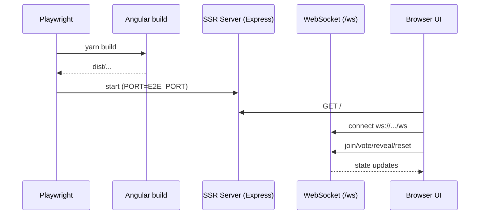

# Testes E2E (Playwright)

## Visão geral

Suíte de testes end-to-end (E2E) que valida os fluxos principais do Buddy Poker Scrum do ponto de vista do usuário, cobrindo SSR + WebSocket no mesmo servidor.

## Responsabilidades

- Subir o app em modo SSR (server build) para validar HTTP + `/ws` em conjunto.
- Exercitar fluxos críticos do MVP: entrar/criar sala, votar, revelar/resetar, permissões de moderador e copiar link.
- Garantir que regressões de UI/integração sejam detectadas sem depender de mocks.

## Entradas e saídas

- Entradas:
  - URL base do servidor E2E via `E2E_PORT` (opcional; default `4205`).
  - Interações reais do usuário (cliques, digitação).
- Saídas:
  - Relatório de testes Playwright (pass/fail).

## Fluxo principal



## Tratamento de erros e casos-limite

- Se o Chromium não estiver instalado, é necessário instalar via Playwright.
- Os testes usam dois contextos de browser para simular dois participantes na mesma sala.

## Exemplos

Rodar E2E:

```bash
yarn e2e
```

Rodar E2E em outra porta:

```bash
E2E_PORT=4300 yarn e2e
```

## Dependências e integrações

- `@playwright/test` para runner e assertions.
- SSR server gerado por `yarn build` e executado por `yarn serve:ssr:buddy-poker`.
- Fluxos dependem do endpoint WebSocket `/ws`.

## Testes P2P WebRTC

A suíte `p2p-webrtc.e2e.spec.ts` valida cenários específicos do modo P2P:

### Cobertura de P2P

1. **Conexão P2P básica (2 peers)**
   - Verifica que dois participantes conseguem conectar
   - Valida que voting funciona em qualquer modo de transporte
   - Detecta modo de transporte via UI tag

2. **Mesh Networking**
   - Testa 3 participantes em topologia mesh
   - Verifica que todos os peers recebem updates
   - Valida que até 8 peers podem se conectar em P2P
   - Confirma broadcast de votos para todos os peers

3. **Fallback Scenarios**
   - Sala com >8 participantes usa WebSocket (não P2P)
   - Verifica que modo P2P não é usado quando limite excedido
   - Confirma funcionalidade mesmo em modo fallback

4. **Peer Disconnection**
   - Testa que sala continua quando peer desconecta
   - Verifica recontagem de participantes
   - Valida que voting funciona após desconexão de peer

### Notas sobre P2P em Testes

- **Ambiente de teste**: Sem servidor TURN, P2P pode cair para WebSocket/HTTP
- **Localhost**: Conexões diretas (host candidates) funcionam em localhost
- **Transport mode detection**: Testes verificam tag de UI para determinar modo atual
- **Timeout aumentado**: P2P pode levar até 20s para estabelecer conexões mesh
- **Funcionalidade prioritária**: Testes validam que app funciona independente do modo

### Executar apenas testes P2P

```bash
yarn e2e p2p-webrtc.e2e.spec.ts
```

### Executar com debug

```bash
yarn e2e --debug p2p-webrtc.e2e.spec.ts
```
