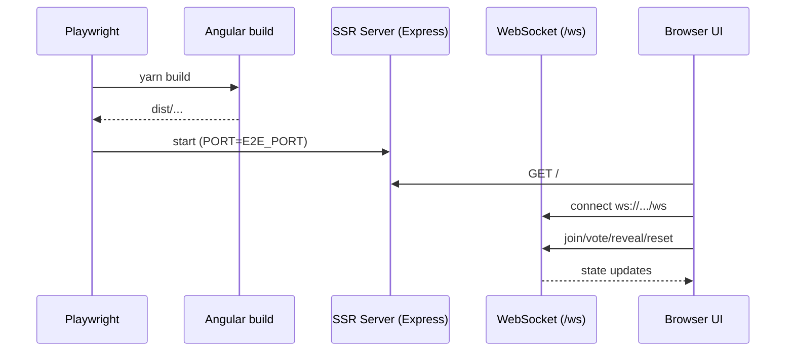

# Testes E2E (Playwright)

## Visão geral

Suíte de testes end-to-end (E2E) que valida os fluxos principais do Buddy Poker Scrum do ponto de vista do usuário, cobrindo SSR + WebSocket no mesmo servidor.

## Responsabilidades

- Subir o app em modo SSR (server build) para validar HTTP + `/ws` em conjunto.
- Exercitar fluxos críticos do MVP: entrar/criar sala, votar, revelar/resetar, permissões de moderador e copiar link.
- Garantir que regressões de UI/integração sejam detectadas sem depender de mocks.

## Entradas e saídas

- Entradas:
  - URL base do servidor E2E via `E2E_PORT` (opcional; default `4205`).
  - Interações reais do usuário (cliques, digitação).
- Saídas:
  - Relatório de testes Playwright (pass/fail).

## Fluxo principal



## Tratamento de erros e casos-limite

- Se o Chromium não estiver instalado, é necessário instalar via Playwright.
- Os testes usam dois contextos de browser para simular dois participantes na mesma sala.

## Exemplos

Rodar E2E:

```bash
yarn e2e
```

Rodar E2E em outra porta:

```bash
E2E_PORT=4300 yarn e2e
```

## Dependências e integrações

- `@playwright/test` para runner e assertions.
- SSR server gerado por `yarn build` e executado por `yarn serve:ssr:buddy-poker`.
- Fluxos dependem do endpoint WebSocket `/ws`.
