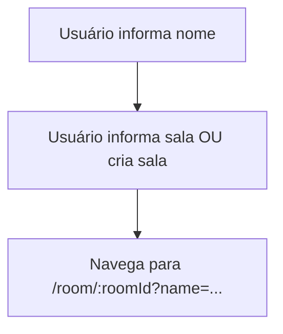

# HomeComponent

## Visão geral

Tela inicial do app. Permite criar uma sala aleatória ou entrar em uma sala existente (planning poker / poker scrum).

## Responsabilidades

- Coletar nome do participante.
- Coletar ou gerar `roomId`.
- Navegar para a rota da sala com `queryParams` (nome).
- Exibir ícone SVG decorativo no título.
- Manter layout responsivo (mobile-first) para campos e ações.

## Entradas e saídas

- Entradas (UI):
  - `name` (string)
  - `roomId` (string)
- Saídas:
  - Navegação para `/room/:roomId?name=...` (e `token` quando presente)

## Fluxo principal

## Tratamento de erros e casos-limite

- Se `name` estiver vazio, exibe mensagem em pt-BR.
- Se `roomId` estiver vazio, exibe mensagem em pt-BR.
- Em telas pequenas, os botões principais ocupam a largura disponível para facilitar o toque.

## Exemplos

- Criar sala: gera um ID no formato `scrumzada-xxxxxx`.
- Entrar: navega para a rota da sala, preservando o nome.
- O campo de sala aceita também um link completo (ex.: `https://host/room/sala?token=...`) para facilitar entrar em salas privadas.

## Dependências e integrações

- `Router` para navegação.
- `FormsModule` (`ngModel`) para bind dos campos.
- PrimeNG para componentes visuais (inputs, botões, card e mensagem).
- Assets estáticos servidos de `/public/svgs` (ícones em SVG).
