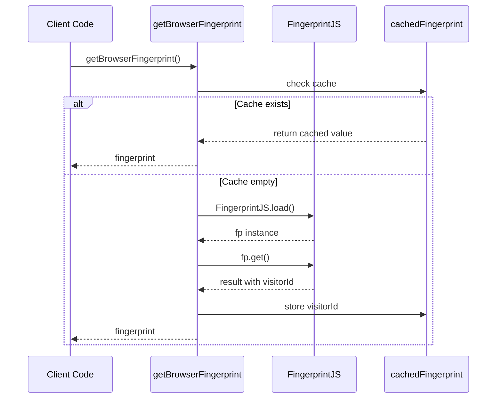
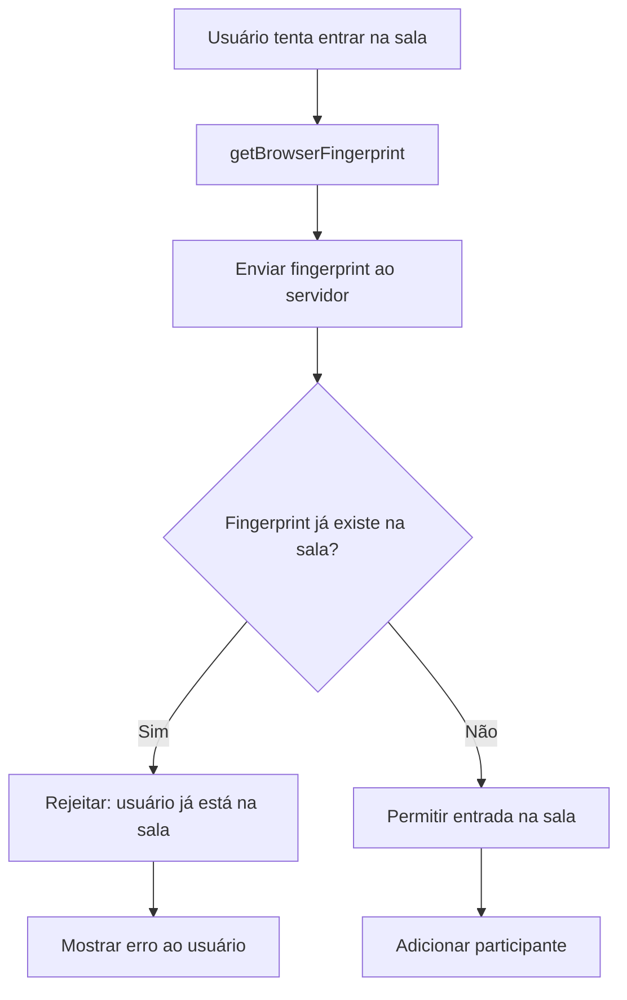

# browser-fingerprint

## Visão geral

Módulo para geração de fingerprint único do navegador, utilizado para garantir que um usuário não possa entrar na mesma sala com identidades diferentes.

## Responsabilidades

- Gerar um identificador único (fingerprint) do navegador/dispositivo do usuário
- Cachear o fingerprint após primeira geração para melhorar performance
- Fornecer identificador consistente durante toda a sessão do usuário

## Entradas e saídas

- Entrada: nenhuma (função sem parâmetros)
- Saída: `Promise<string>` - fingerprint único do navegador

## API / Assinatura

```typescript
async function getBrowserFingerprint(): Promise<string>
```

## Fluxo principal



## Tratamento de erros e casos-limite

- O fingerprint é gerado de forma assíncrona
- Cache é mantido em memória durante toda a sessão
- Se a biblioteca FingerprintJS falhar, a Promise será rejeitada

## Exemplos

```typescript
import { getBrowserFingerprint } from './browser-fingerprint';

// Gerar fingerprint do navegador
const fingerprint = await getBrowserFingerprint();
console.log(fingerprint); // "abc123def456..."

// Chamadas subsequentes retornam valor cacheado (mais rápido)
const sameFp = await getBrowserFingerprint();
console.log(fingerprint === sameFp); // true
```

## Dependências e integrações

- **Biblioteca externa**: [@fingerprintjs/fingerprintjs](https://www.npmjs.com/package/@fingerprintjs/fingerprintjs) v5.0.1
- **Usado em**: [poker-ws.service.ts](poker-ws.service.ts) para identificar usuário ao conectar na sala
- **Validado em**: [../server.ts](../server.ts) para garantir unicidade de participantes

## Detalhes técnicos

### FingerprintJS

A biblioteca FingerprintJS analisa diversas características do navegador e dispositivo para gerar um identificador único:

- User Agent
- Resolução de tela
- Timezone
- Canvas fingerprinting
- WebGL fingerprinting
- Plugins instalados
- Fontes disponíveis
- E outros atributos do navegador

### Cache

O fingerprint é armazenado em uma variável módulo (`cachedFingerprint`) que persiste durante toda a execução da aplicação. Isso evita:

- Múltiplas chamadas à biblioteca FingerprintJS
- Processamento desnecessário
- Possíveis variações no fingerprint durante a mesma sessão

## Integração com sistema de salas



## Limitações conhecidas

- **Navegação privada**: Pode gerar fingerprints diferentes entre sessões
- **Mudança de browser**: Mesmo usuário em browsers diferentes terá fingerprints diferentes (comportamento esperado)
- **Bloqueadores de fingerprinting**: Extensões que bloqueiam fingerprinting podem afetar a geração
- **Ambiente SSR**: Fingerprint só funciona no navegador (não disponível em Server-Side Rendering)
