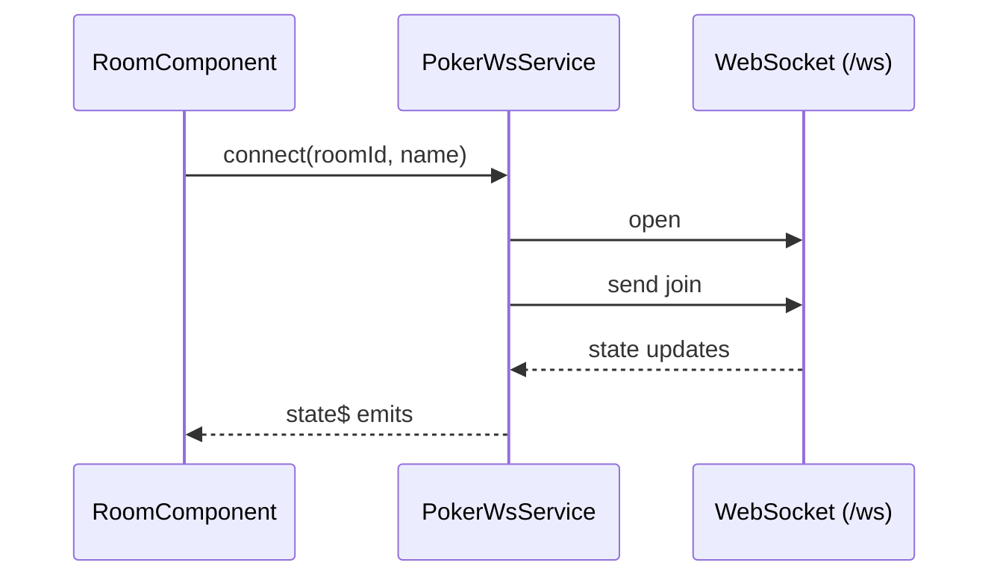

# PokerWsService

## Visão geral

Serviço Angular responsável por conectar no WebSocket do backend (`/ws`) e expor o estado da sala de planning poker para os componentes.

## Responsabilidades

- Abrir conexão WebSocket em `ws(s)://<host>/ws`.
- Enviar mensagens de `join`, `vote`, `reveal` e `reset`.
- Expor `state$` (RxJS) com o estado da sala recebido do servidor.
- Fazer reconnect automático com backoff (quando a desconexão não é manual).
- Expor `status$` com o estado da conexão para a UI.
- Evitar uso de WebSocket durante SSR (somente browser).

## Entradas e saídas

- Entradas:
  - `connect(roomId, name, token?)`
  - `vote(value)`
  - `reveal()`
  - `reset()`
  - `disconnect()`
- Saídas:
  - `state$`: `Observable<PokerRoomViewState | null>`
  - `clientId$`: `Observable<string | null>`
  - `roomToken$`: `Observable<string | null>` (token retornado pelo servidor para o moderador compartilhar o link)
  - `error$`: `Observable<string | null>` (mensagens do servidor, ex.: ação não autorizada)
  - `status$`: `Observable<'disconnected' | 'connecting' | 'connected' | 'reconnecting'>`

## Fluxo principal



## Tratamento de erros e casos-limite

- Se o código estiver rodando no SSR, `connect()` não faz nada.
- Mensagens recebidas que não sejam JSON válido são ignoradas.
- Se o socket não estiver `OPEN`, `send()` não envia.
- Mensagens `error` do servidor atualizam `error$`.
- `disconnect()` cancela tentativas de reconnect.

## Exemplos

```ts
this.ws.connect('scrumzada-abc123', 'Dev Ninja');
// ou, ao entrar via link compartilhado:
this.ws.connect('scrumzada-abc123', 'Dev Ninja', 'token-da-sala');
this.ws.vote('8');
this.ws.reveal();
this.ws.reset();
```

## Dependências e integrações

- `rxjs`: `BehaviorSubject` e `Observable`.
- Protocolo de mensagens definido em `poker-types.ts`.
- Backend em [src/server.ts](../../server.ts).
