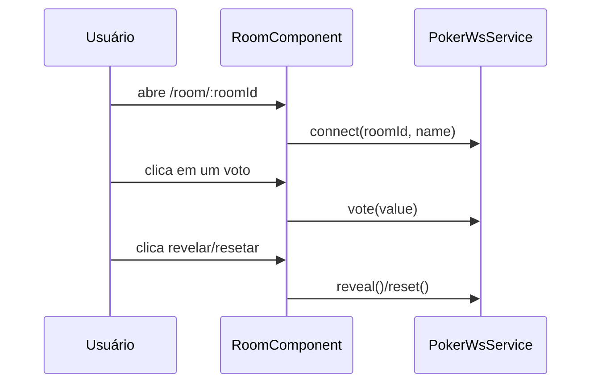

# RoomComponent

## Visão geral

Tela da sala de planning poker. Mostra participantes, permite votar, revelar e resetar.

## Responsabilidades

- Ler o `roomId` da rota (`/room/:roomId`).
- Obter `name` via query string (`?name=`) ou `sessionStorage` (somente browser).
- Conectar no WebSocket via `PokerWsService`.
- Renderizar lista de participantes e status do voto.
- Destacar e animar o voto selecionado (feedback visual no botão).
- Exibir ações de moderador (revelar/resetar) somente quando o cliente for o dono da sala.
- Exibir status de conexão (conectado/reconectando/desconectado).
- Permitir copiar o link da sala.
- Exibir ícone SVG decorativo no header da sala.
- Manter layout responsivo (mobile-first) para ações, formulários e listas.
- Garantir área tocável confortável e legibilidade nas “cartas” (botões de voto e cards de voto dos participantes).

## Entradas e saídas

- Entradas:
  - Route param: `roomId`
  - Query param: `name` (opcional)
  - Query param: `token` (opcional; usado para salas privadas)
  - Interações: votar, revelar, resetar
- Saídas:
  - Mensagens WebSocket enviadas via `PokerWsService`

## Fluxo principal

## Tratamento de erros e casos-limite

- Em SSR, não acessa `sessionStorage` e não tenta conectar no WebSocket.
- Se o usuário abrir a sala sem nome, o componente mostra um campo para entrar.
- Se o servidor recusar uma ação (ex.: não moderador), o componente exibe a mensagem recebida.
- Se o WebSocket cair, o client tenta reconnect e o status é exibido na UI.
- Se a sala exigir `token` e o token estiver ausente/incorreto, o servidor retorna `{type:"error"}`.
- Em telas pequenas, ações e formulários empilham para reduzir overflow e melhorar tocabilidade.

## Exemplos

- Opções de voto: `0,1,2,3,5,8,13,21,?,☕`.
- Link compartilhável (sala privada): `/room/<roomId>?token=<token>`.
- Ao selecionar um voto, o botão selecionado recebe destaque e executa um efeito de “flip/pulse”.
- Enquanto `reveal=false`, o voto aparece como `🎴` (votou) ou `…` (ainda não).
- Ao revelar, as “cartas” fazem um flip 3D e mostram o valor.
- Os botões de voto têm tamanho ampliado para melhorar o uso em touch.

## Dependências e integrações

- `ActivatedRoute` para params e query.
- `PokerWsService` para WebSocket.
- PrimeNG para componentes visuais (botões, cards, mensagens, tags).
- Assets estáticos servidos de `/public/svgs` (ícones em SVG).
- Estado recebido do backend em [src/server.ts](../../server.ts).
