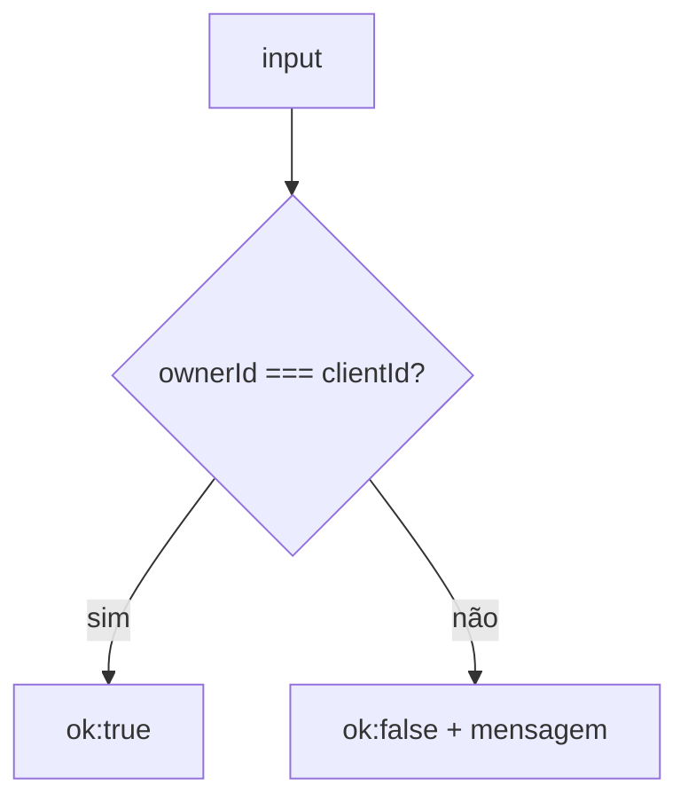

# poker-permissions

## Visão geral

Regras de permissão para ações sensíveis na sala (ex.: revelar votos e resetar rodada).

O servidor define um **moderador** por sala (`ownerId`). Algumas mensagens só podem ser aplicadas quando `ownerId === clientId`.

## Responsabilidades

- Centralizar a decisão: “este cliente pode executar esta ação?”
- Padronizar mensagens de erro (pt-BR) para casos negados.

## Entradas e saídas

- Entrada:
  - `ownerId: string | null`
  - `clientId: string`
  - `action: 'reveal' | 'reset'`
- Saída:
  - `{ ok: true }` quando permitido
  - `{ ok: false; message: string }` quando negado

## Fluxo principal



## Tratamento de erros e casos-limite

- Quando `ownerId` é `null`, a ação é negada.
- Mensagens de erro são sempre em pt-BR.

## Exemplos

```ts
assertModeratorAction({ ownerId: 'a', clientId: 'a', action: 'reveal' });
// { ok: true }

assertModeratorAction({ ownerId: 'a', clientId: 'b', action: 'reset' });
// { ok: false, message: 'Apenas o moderador pode resetar a rodada.' }
```

## Dependências e integrações

- Usado em [src/server.ts](server.ts) nos handlers de `reveal` e `reset`.
