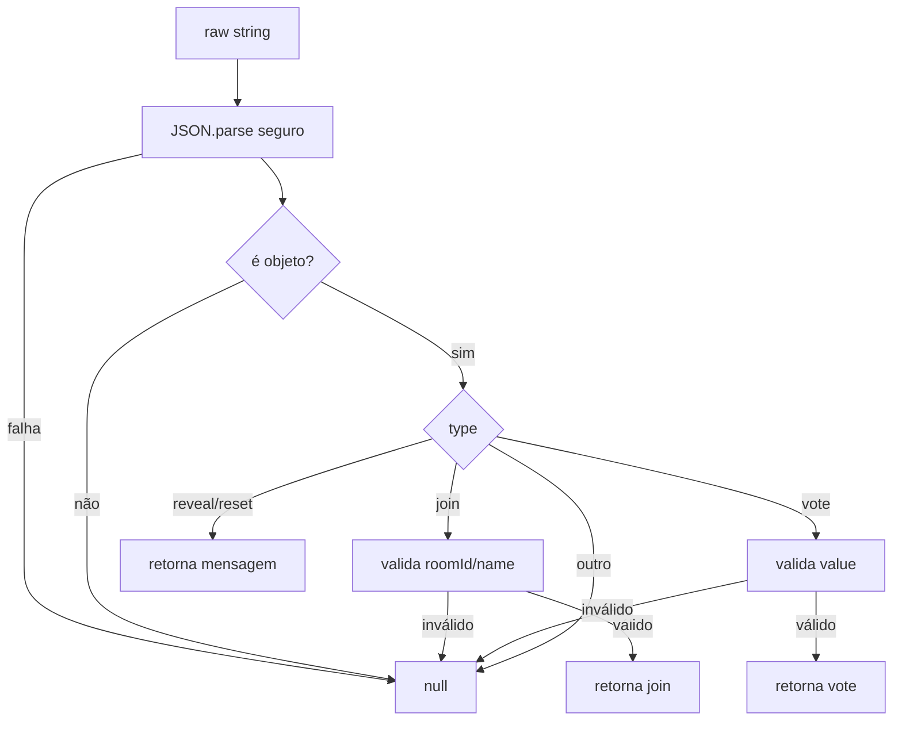

# poker-ws-protocol

## Visão geral

Módulo responsável por **interpretar e validar** mensagens recebidas do cliente via WebSocket.

O objetivo é centralizar:

- Parsing de JSON de forma segura
- Validação mínima de payload por tipo de mensagem

## Responsabilidades

- Converter `raw: string` em uma mensagem tipada (ou `null`).
- Aplicar validação mínima coerente com o servidor:
  - `join` exige `roomId` e `name` como `string`.
  - `join` aceita `token`, `fingerprint` e `clientId` opcionais como `string`.
  - `vote` exige `value` como `string` e aceita `actionId` opcional.
  - `reveal` e `reset` aceitam `actionId` opcional.

## Entradas e saídas

- Entrada:
  - `raw: string` (payload recebido do WebSocket)
- Saída:
  - `PokerWsMessageFromClient | null`

## Fluxo principal



## Tratamento de erros e casos-limite

- JSON inválido retorna `null`.
- JSON válido, porém não-objeto (ex.: `null`, `[]`, `123`) retorna `null`.
- Campos extras são ignorados.
- `token`, `fingerprint` e `clientId` em `join` só são aceitos quando são `string`.
- `actionId` é aceito quando é uma string não vazia de até 128 caracteres.

`actionId` é compartilhado pelo transporte HTTP e WebSocket. O servidor mantém uma janela
limitada por participante; repetir uma ação já aceita retorna sucesso sem aplicar novamente a
mutação. Clientes antigos sem `actionId` continuam compatíveis.

## Exemplos

```ts
parsePokerWsMessageFromClient('{');
// null

parsePokerWsMessageFromClient(JSON.stringify({ type: 'join', roomId: 'r', name: 'n' }));
// { type: 'join', roomId: 'r', name: 'n' }

parsePokerWsMessageFromClient(JSON.stringify({ type: 'join', roomId: 'r', name: 'n', clientId: 'c1' }));
// { type: 'join', roomId: 'r', name: 'n', clientId: 'c1' }

parsePokerWsMessageFromClient(JSON.stringify({ type: 'vote', value: '5' }));
// { type: 'vote', value: '5' }
```

## Dependências e integrações

- Usado em [src/server.ts](server.ts) para validar mensagens antes de aplicar regras de sala.
