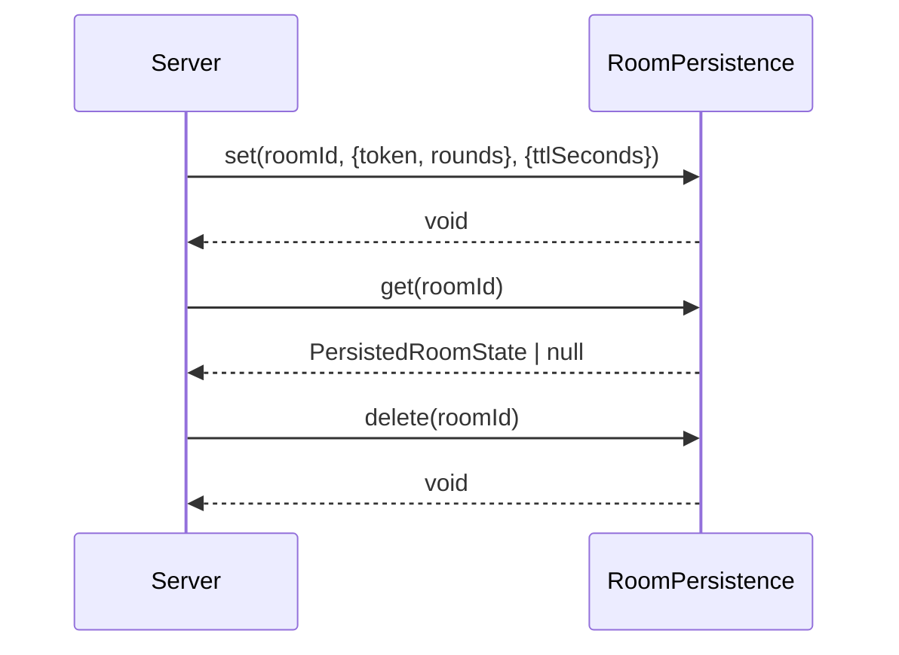

# room-persistence

## Visão geral

Este módulo define uma abstração simples para persistir **metadados de sala** (token e histórico de rodadas) fora do processo.

O objetivo é permitir uma persistência opcional (ex.: Redis) sem alterar a UI e sem acoplar o servidor a uma implementação específica.

## Responsabilidades

- Definir o contrato `RoomPersistence`.
- Fornecer uma implementação em memória (`createInMemoryRoomPersistence`) útil para ambiente local e testes.
- Definir a convenção de chave (`buildRoomPersistenceKey`).

## Entradas e saídas

- Entradas:
  - `roomId` (normalizado no servidor).
  - `PersistedRoomState`:
    - `token`: string
    - `rounds`: `PokerRoundHistoryEntry[]`
  - TTL opcional (`ttlSeconds`).
- Saídas:
  - `get(roomId)` retorna `PersistedRoomState | null`.

## Fluxo principal



## Tratamento de erros e casos-limite

- TTL inválido (<= 0 ou não finito) é tratado como "sem expiração" na implementação em memória.
- A implementação em memória expira entradas apenas quando acessadas via `get`.

## Exemplos

```ts
import { createInMemoryRoomPersistence } from './room-persistence';

const persistence = createInMemoryRoomPersistence();
await persistence.set('room-1', { token: 't', rounds: [] }, { ttlSeconds: 3600 });

const state = await persistence.get('room-1');
```

## Dependências e integrações

- Depende do tipo `PokerRoundHistoryEntry` de [round-history.ts](round-history.ts).
- A integração com Redis fica em [redis-room-persistence.ts](redis-room-persistence.ts).
