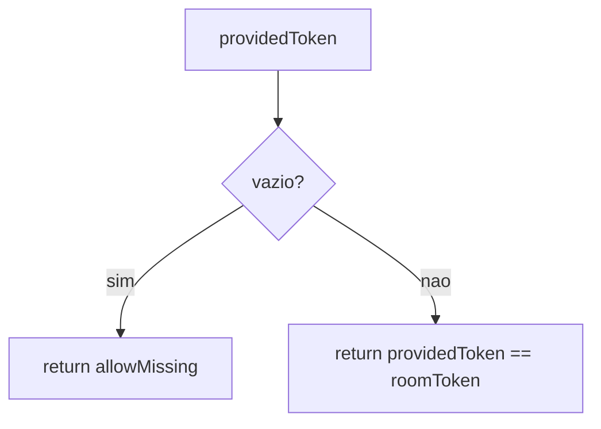

# room-token

## Visão geral

Helpers simples para validação de token de sala.

## Responsabilidades

- Decidir se um token informado pelo cliente é aceito para uma sala.
- Permitir uma exceção para o primeiro participante (que cria/entra na sala pela primeira vez).
- A recuperação de moderador sem token só é aceita quando a reserva persistida continua válida
  e a impressão digital da sessão coincide; um token inválido nunca é aceito.

## Entradas e saídas

- Entrada:
  - `roomToken`: token armazenado no estado da sala.
  - `providedToken`: token enviado pelo cliente (opcional).
  - `allowMissing`: permite ausência de token (usado no primeiro join).
- Saída:
  - `boolean` indicando se a conexão pode prosseguir.

## API / Assinatura

```ts
export function isTokenAllowed(options: {
  roomToken: string;
  providedToken?: string;
  allowMissing: boolean;
}): boolean;
```

## Fluxo principal



## Tratamento de erros e casos-limite

- Token enviado com espaços é normalizado via `trim()`.

## Dependências e integrações

- Integrado em [src/server.ts](server.ts) no handler de `join`.
- A reserva de moderador expirada é removida antes de qualquer ação e a promoção segue a ordem
  atual dos participantes.
