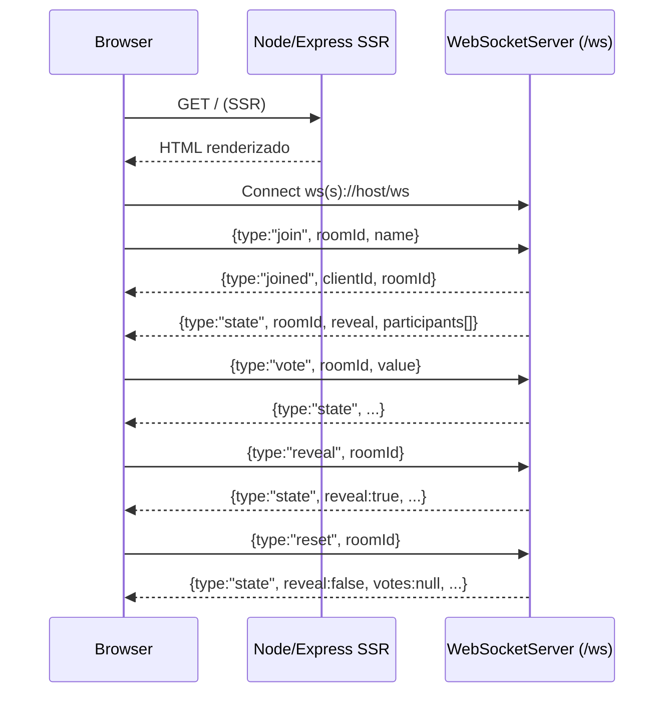

# src/server.ts

## Visão geral

Servidor Node/Express usado pelo SSR do Angular, com um WebSocket server no mesmo processo para sincronizar uma sala de *planning poker* ("poker scrum").

## Responsabilidades

- Servir os assets gerados em `dist/.../browser`.
- Renderizar a aplicação Angular via `AngularNodeAppEngine` (SSR).
- Manter estado **em memória** de salas de planning poker (participantes e sockets).
- Manter histórico **em memória** das rodadas (limitado por sala).
- Persistir opcionalmente **metadados de sala** (token e histórico) em storage externo (ex.: Redis).
- Definir um moderador por sala (primeiro participante conectado).
- Proteger salas com token simples (evita entrar “por acaso” sem o link correto).
- Aceitar conexões WebSocket em `/ws` e publicar o estado da sala.

## Entradas e saídas

- Entrada HTTP:
  - Requisições para assets estáticos e rotas do Angular.
- Entrada WebSocket (`/ws`): mensagens JSON.
- Saída WebSocket: broadcast do estado da sala para todos os clientes conectados.

## Fluxo principal



## Tratamento de erros e casos-limite

- Mensagens inválidas (JSON inválido ou campos faltantes) são ignoradas silenciosamente.
- Apenas o moderador pode executar `reveal` e `reset` (caso contrário, o servidor envia `{type:"error"}`).
- A partir do 2º participante, a sala exige `token` (enviado pelo moderador no link compartilhado).
- O servidor aplica rate limit por conexão WS para reduzir spam de mensagens.
- O WebSocket server usa heartbeat ping/pong para encerrar conexões zumbis.
- O estado de participantes é em memória: reiniciar o processo derruba conexões e limpa participantes.
- Persistência opcional (Redis):
  - Se `REDIS_URL` estiver definido, o servidor persiste `token` e `rounds` por sala.
  - TTL padrão via `ROOM_TTL_SECONDS` (default: `86400`).
  - Prefixo de chave via `REDIS_KEY_PREFIX` (default: `buddy-poker:room:`).
  - Isso não resolve sincronização de sockets entre instâncias; para multi-instância real, use sticky sessions e/ou pub/sub.
- Salas são removidas quando o último participante desconecta.

## Exemplos

### Mensagens do cliente

```json
{ "type": "join", "roomId": "scrumzada-abc123", "name": "Dev Ninja" }
```

```json
{ "type": "join", "roomId": "scrumzada-abc123", "name": "Dev Ninja", "token": "<token-da-sala>" }
```

```json
{ "type": "vote", "roomId": "scrumzada-abc123", "value": "5" }
```

### Mensagens do servidor

```json
{
  "type": "state",
  "roomId": "scrumzada-abc123",
  "reveal": false,
  "participants": [
    { "id": "k3m9x2p1", "name": "Dev Ninja", "hasVoted": true, "vote": null }
  ]
}
```

## Dependências e integrações

- `@angular/ssr/node`: engine de SSR do Angular.
- `express`: servidor HTTP.
- `ws`: WebSocket server.
- Rate limit por conexão via [src/rate-limit.ts](rate-limit.ts).
- Parsing/validação de mensagens WS via [src/poker-ws-protocol.ts](poker-ws-protocol.ts).
- Regras de permissão do moderador via [src/poker-permissions.ts](poker-permissions.ts).
- Histórico de rodadas via [src/round-history.ts](round-history.ts).
- Persistência (interface) via [src/room-persistence.ts](room-persistence.ts).
- Persistência opcional Redis via [src/redis-room-persistence.ts](redis-room-persistence.ts) (habilita com `REDIS_URL`).
- Integra com o front-end via protocolo JSON simples (sem autenticação).
