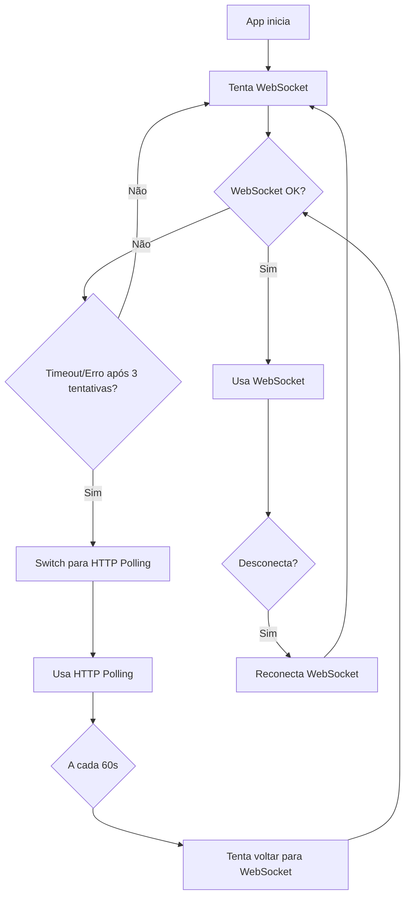

# Transport Fallback - WebSocket to HTTP

## Visão geral

Implementação de fallback automático de WebSocket para HTTP polling, garantindo que o app continue funcionando mesmo quando WebSocket não está disponível (proxy, firewall, restrições de navegador).

## Arquitetura

### Abstração de Transporte

A camada de transporte foi abstraída em uma interface `Transport` com duas implementações:

1. **WebSocketTransport** - Transporte via WebSocket (modo preferencial)
2. **HttpPollingTransport** - Transporte via HTTP polling (fallback)

### Fluxo de Fallback



## Componentes

### 1. Transport Types (`transport.types.ts`)

Define as interfaces e tipos compartilhados:

- `Transport` - Interface base para todos os transportes
- `TransportStatus` - Estados do transporte (disconnected, connecting, connected, reconnecting)
- `TransportMode` - Tipo de transporte (websocket, http-polling)
- `TransportConfig` - Configurações de timeout e reconexão
- `TransportEventHandlers` - Callbacks para eventos

### 2. WebSocketTransport (`websocket-transport.ts`)

Implementação de transporte via WebSocket:

- **Conexão**: Conecta em `ws(s)://<host>/ws`
- **Timeout**: 5 segundos (configurável)
- **Reconexão**: Exponential backoff (500ms a 10s)
- **Max tentativas**: 3 (configurável) antes de dar up e permitir fallback

Características:
- Heartbeat via ping/pong (gerenciado pelo servidor)
- Detecção de timeout de conexão
- Reconexão automática com backoff exponencial
- Sinaliza quando falha definitivamente para permitir fallback

### 3. HttpPollingTransport (`http-polling-transport.ts`)

Implementação de transporte via HTTP polling:

- **POST `/api/poker/action`**: Envia ações (join, vote, reveal, reset)
- **GET `/api/poker/events`**: Recebe eventos (polling a cada 1.5s, configurável)
- **Sequenciamento**: Usa `lastEventId` para evitar duplicatas
- **Sessão**: Mantém `clientId` entre requests

Características:
- Polling intervalado para receber eventos
- Fila de eventos no servidor (últimos 100 por cliente)
- Session management com TTL de 5 minutos
- Reconexão automática em caso de session expiry

### 4. PokerWsService (refatorado)

Serviço Angular que gerencia o transporte:

- **Inicialização**: Sempre tenta WebSocket primeiro
- **Fallback**: Switch automático para HTTP quando WebSocket falha
- **Retry**: Tenta voltar para WebSocket a cada 60s quando em HTTP
- **Transparência**: API pública permanece a mesma (connect, vote, reveal, reset)
- **Supressão de Erros**: Não exibe erros de WebSocket na UI quando em modo HTTP polling (evita assustar usuários)

Novo observable:
- `mode$` - Emite o modo de transporte atual ('websocket' | 'http-polling')

## Backend

### Endpoints HTTP de Fallback

#### POST `/api/poker/action`

Recebe ações do cliente em modo HTTP.

**Request**:
```json
{
  "type": "join",
  "roomId": "room-1",
  "name": "User Name",
  "token": "optional-token"
}
```

**Headers**:
- `Content-Type: application/json`
- `X-Client-Id: <clientId>` (opcional, obrigatório para ações que não sejam join)

**Response**:
```json
{
  "clientId": "abc123",
  "message": {
    "type": "joined",
    "clientId": "abc123",
    "roomId": "room-1",
    "token": "room-token"
  }
}
```

#### GET `/api/poker/events?clientId=<id>&lastEventId=<num>`

Retorna eventos novos desde `lastEventId`.

**Response**:
```json
{
  "events": [
    {
      "id": 123,
      "message": {
        "type": "state",
        "roomId": "room-1",
        "ownerId": "abc123",
        "reveal": false,
        "participants": [...]
      }
    }
  ]
}
```

### Gestão de Sessões HTTP

- **httpSessions**: Map de clientId → HttpClientSession
- **eventQueue**: Map de clientId → Array de eventos
- **TTL**: 5 minutos de inatividade
- **Cleanup**: A cada 60 segundos

### Broadcast para Clientes HTTP

Quando o estado da sala muda (via WebSocket ou HTTP), o servidor:

1. Faz broadcast via WebSocket para clientes WS
2. Enfileira eventos para clientes HTTP (via `broadcastRoomStateHttp`)

## Configuração

As configurações podem ser definidas via `window` globals:

```typescript
window.WS_CONNECTION_TIMEOUT_MS = 5000;       // Timeout de conexão WS
window.WS_RECONNECT_BASE_DELAY_MS = 500;      // Delay base para reconexão
window.WS_RECONNECT_MAX_DELAY_MS = 10000;     // Delay máximo para reconexão
window.HTTP_POLLING_INTERVAL_MS = 1500;       // Intervalo de polling HTTP
```

Valores padrão estão em `PokerWsService.getTransportConfig()`.

## Testes

### Unitários

- `websocket-transport.spec.ts` - Testes do WebSocketTransport
- `poker-ws.service.spec.ts` - Testes do serviço (já existentes, adaptados)

### Teste Manual (DevTools)

1. Abra a aplicação
2. Abra DevTools (F12) → Network
3. Filtre por WS (WebSocket)
4. Right-click no WebSocket → Block request URL
5. Recarregue a página

O app deve:
- Tentar WebSocket (verá timeout/falha)
- Alternar para HTTP polling automaticamente
- Mostrar logs no console: `[PokerWsService] WebSocket failed, switching to HTTP polling`
- Continuar funcionando normalmente (join, vote, reveal, reset)

### Logs/Telemetria

O sistema emite logs relevantes no console:

```
[PokerWsService] Switching to WebSocket transport
[WebSocketTransport] Connection timeout
[PokerWsService] WebSocket failed, switching to HTTP polling
[PokerWsService] Switching to HTTP polling transport
[PokerWsService] Attempting to switch back to WebSocket...
```

## Limitações e Trade-offs

### WebSocket (modo preferencial)
- ✅ Baixa latência
- ✅ Bidirecional
- ✅ Eficiente (menos overhead)
- ❌ Pode ser bloqueado por proxy/firewall

### HTTP Polling (fallback)
- ✅ Funciona em qualquer ambiente HTTP
- ✅ Passa por proxy/firewall
- ❌ Maior latência (polling interval)
- ❌ Mais overhead (HTTP headers em cada request)
- ❌ Mais carga no servidor (polling constante)

### Polling Interval

Intervalo de 1.5 segundos é um compromisso:
- Menor: Mais responsivo, mas mais carga
- Maior: Menos carga, mas menos responsivo

Para salas com muitos usuários ou muita atividade, considere ajustar para 1-2s.

## Próximos Passos (Opcionais)

1. **Server-Sent Events (SSE)**: Substituir polling por SSE quando disponível
2. **Métricas**: Adicionar telemetria para rastrear uso de fallback
3. **Adaptive Polling**: Ajustar intervalo dinamicamente baseado em atividade
4. **Compression**: Comprimir payloads HTTP (gzip)
5. **Connection Health**: Indicador visual do modo de transporte no UI
